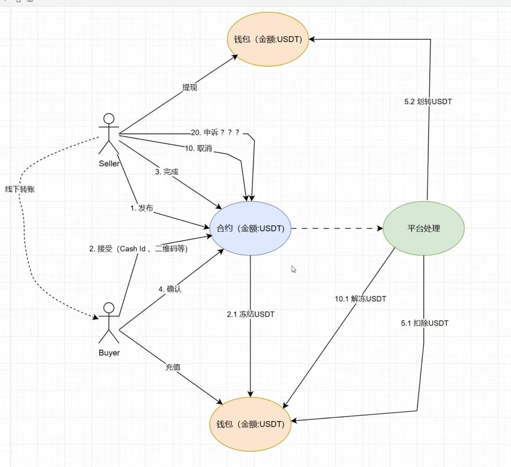

# C2C 模块逻辑

## 业务模型定义

### 订单信息 order

注册用户都可以发布订单信息，包含了
1. 总价值U,
2. 锁定价值 LOCKED-U,
3. 消耗价值 CONSUMED-U,
3. 交易最低价值 LOW-U,
4. 交易最高价值 MAX-U,
5. 过期时间 EXPIRE-TIME,
6. 卖家 SELLER,
7. 备注信息  NOTE,

### 交易信息 trade

注册用户都可以对订单信息买入，生成交易信息，包含了
1. 交易价值 U,
2. 订单信息 ID,
3. 买家 BUYER,
4. 买家确认时间 CONFIRM-TIME,
5. 卖家放款时间 LOAN-TIME,
6. 买家备注信息 NOTE,

### 卖家

充值到平台的用户都可以成为卖家

### 买家

注册用户都可以成为买家。

### 平台方

平台方负责托管用户的充值U，并收取交易手续费。

### 支付通道

支付通道负责收取用户充值的U，并转给卖家。

### 平台钱包

用户可通过平台钱包查看充值U

## 核心逻辑

1. 充值用户可通过锁定U的形式发布订单，发布人即卖家。
2. 其他用户可对订单创建交易，交易人即买家。
3. 订单可设置价格，价格可设置范围，任务可设置过期时间。
4. 卖家可取消订单，取消订单后剩余U退回到钱包账户。剩余U = 总价值 - 消耗价值U
5. 买家可取消交易，取消交易后订单的锁定U减少。
6. 订单下有未完成的交易时不可取消。
7. 交易成功后订单的消耗U增加，锁定U减少。

## 前端地址

利用v0.app生成，访问地址为：https://v0-okx-c2-c-app.vercel.app/